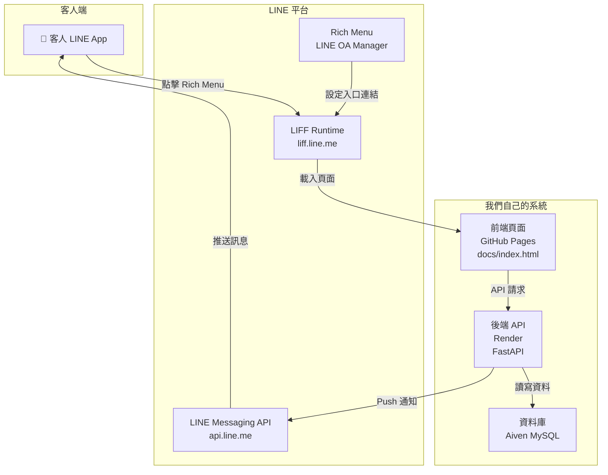
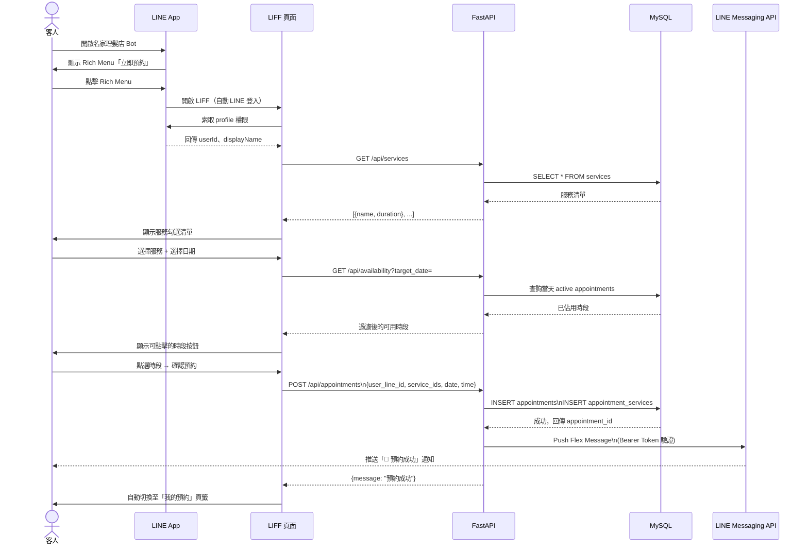
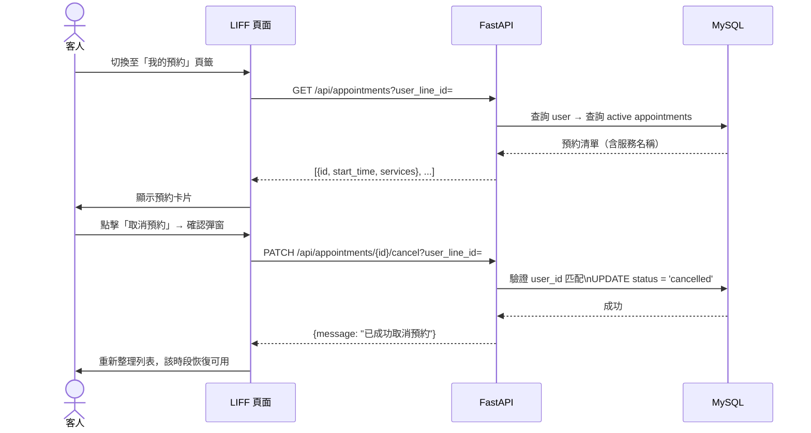

# 開發紀錄：名家理髮廳預約系統

## 必要連結

| 項目 | 連結 |
|---|---|
| LINE LIFF 預約頁面 | https://liff.line.me/2009389155-HyKE5PeC |
| 後端 API（Render） | https://salon-api-zhou-wei-lun.onrender.com |
| Render 部署 Dashboard | https://dashboard.render.com/web/srv-d6ne7aa4d50c73dg6ce0/logs?r=live |
| GitHub Repository | https://github.com/lalyuns/salon-booking-system |
| 店家地圖 | https://share.google/VwdpyG9pYoZ6DaOg6 |

---

## All achievements

### 階段一：打好地基（資料庫 + 基礎 API）

建立整個系統的骨架：定義 5 張資料表（`users`、`designers`、`services`、`appointments`、`appointment_services`），並用 SQLAlchemy ORM 管理與 MySQL 的連線。同時建立最基礎的 API 端點，讓前端有資料可以拿。

**意義**

資料庫結構是整個系統的地基。多對多的 `appointment_services` 關聯表讓一筆預約可以同時包含多項服務（如「剪髮＋染髮」），符合美髮店的真實使用情境。設計好這層關係，後續所有功能才能正確疊加上去。

---

### 階段二：前端 LIFF 介面

在 `docs/index.html` 建立 LINE LIFF 網頁，整合 LINE 登入，讓系統能識別是哪位客人在預約。前端分兩個步驟引導客人完成預約：先選服務項目，再選日期與時段，最後確認送出。

**意義**

客人不需要下載任何 App，直接在 LINE 裡就能完成預約。LINE 登入同時幫我們取得客人的 `user_id`，作為識別身份的唯一鍵值，免去帳號註冊的摩擦。

---

### 階段三：建立預約 API（後端核心）

實作 `POST /api/appointments`，接收前端送來的服務清單、日期、時間與 LINE ID，在資料庫中建立一筆完整的預約紀錄。同時修正了多對多關聯表的寫入邏輯，讓 SQLAlchemy ORM 自動處理中介表，避免 Foreign Key 錯誤。

**意義**

這是整個系統最核心的寫入流程。修正關聯表的寫法讓程式碼更穩定，也確保每筆預約都能正確記錄客人選了哪些服務，是後續計算耗時與避免衝突的基礎。

---

### 階段四：智慧時段演算法（防撞期）

使用動態演算法：

1. 自動產生當天 10:00～18:00 每 30 分鐘一格的所有可能時段
2. 查詢資料庫中當天所有狀態為 `active` 的預約
3. 對每個時段做**時間重疊檢測**，若與任何現有預約衝突則濾除
4. 只回傳真正空閒的時段給前端

**意義**

這是系統能實際商用的關鍵。沒有這個演算法，兩個客人可能同時搶到同一個時段，造成現場衝突。加上重疊檢測後（而非只比對起始時間），即使是 1 小時的預約也能正確封鎖中間的 10:30 時段，不會有縫隙讓第二個客人插進去。

---

### 階段五：我的預約 + 取消功能

- 後端新增 `GET /api/appointments` 查詢客人自己的所有有效預約
- 後端新增 `PATCH /api/appointments/{id}/cancel` 取消指定預約（只有本人可操作）
- 前端加入分頁列，新增「我的預約」頁籤，以卡片形式列出預約紀錄，每張卡片附有紅色取消按鈕
- 取消後自動重新整理列表，同時恢復該時段的可用狀態

**意義**

預約系統若沒有取消功能，客人只能直接放棄、變成失約，店家白白損失一個時段。讓客人能自助取消，既降低客服負擔，也讓店家能及早得知空缺、接受其他預約。

---

### 階段六：LINE 預約成功通知

預約成功後，後端自動向 LINE Messaging API 推送一則 **Flex Message** 圖文訊息給客人，內容包含日期、時間、服務項目。若 `LINE_CHANNEL_ACCESS_TOKEN` 未設定，系統靜默略過，不影響預約主流程。

**意義**

通知解決了「客人預約完不確定有沒有成功」的焦慮感，也留下一筆有憑有據的紀錄，客人隨時可以回頭查詢時間。LINE 訊息通知比 Email 有更高的開封率，在台灣用戶習慣 LINE 的環境下尤其有效。

---

### 階段七：部署上線

- 前端透過 **GitHub Pages** 自動部署（`docs/` 資料夾）
- 後端透過 **Render** 部署，設定好環境變數（`DATABASE_URL`、`LINE_CHANNEL_ACCESS_TOKEN`、`TZ`）
- 每次 `git push` 到 `main` 後，Render 自動拉取最新程式碼並重新部署

**意義**

GitHub Pages + Render 的組合讓整個系統的維運成本趨近於零。每次改完程式只要 push，兩端都自動更新，不需要手動 SSH 進伺服器操作。

---

### 階段八：LINE Rich Menu 整合

在 LINE Official Account Manager 設定圖文選單（Rich Menu），讓客人打開與 Bot 的對話時，底部就會出現一個固定的「立即預約」按鈕，點擊後直接開啟 LIFF 預約頁面。

**意義**

沒有 Rich Menu 之前，客人必須自己記得或翻找預約連結，入口不直覺。Rich Menu 把預約按鈕永遠釘在畫面最下方，客人想預約時一眼就找得到，大幅降低使用摩擦，提高實際預約轉換率。

---

## 系統現有 API 一覽

| 方法 | 路徑 | 功能 |
|---|---|---|
| `GET` | `/api/services` | 取得所有服務項目與耗時 |
| `GET` | `/api/availability?target_date=` | 查詢指定日期的可用時段（智慧演算法） |
| `POST` | `/api/appointments` | 建立預約，同時推送 LINE 通知 |
| `GET` | `/api/appointments?user_line_id=` | 查詢客人自己的所有有效預約 |
| `PATCH` | `/api/appointments/{id}/cancel?user_line_id=` | 取消指定預約 |

---

## 系統架構與資料流程圖

### 整體系統架構

---

### 預約完整流程（Sequence Diagram）

---

### 查詢 / 取消預約流程

---

### 權限與設定總覽

> 給隊友的清單：每個元件需要什麼權限、在哪裡設定、誰持有。

| 元件 | 需要的權限 / 金鑰 | 在哪裡設定 | 備註 |
|---|---|---|---|
| LIFF 頁面 | `profile` scope（取得 userId） | LINE Developers Console → LIFF → Scopes | 預設已開啟，不需額外申請 |
| LINE Messaging API Push | `Channel Access Token`（長期） | LINE Developers Console → Messaging API → Channel access token | 存放於 Render 環境變數 |
| Webhook | 公開 HTTPS URL + 回傳 200 | LINE Developers Console → Messaging API → Webhook URL | URL：`https://salon-api-zhou-wei-lun.onrender.com/webhook` |
| Rich Menu | LINE Official Account 管理員權限 | LINE Official Account Manager | 設定者需為 OA 的 Admin 或 Member |
| FastAPI（Render） | `DATABASE_URL`、`LINE_CHANNEL_ACCESS_TOKEN`、`TZ` | Render Dashboard → Environment | 不可提交至 Git |
| MySQL（Aiven） | 資料庫帳密（含於 `DATABASE_URL`） | Aiven Console | 連線需 SSL |
| GitHub Pages | Public repository | GitHub repo → Settings → Pages → Branch: main /docs | 免費靜態托管 |

